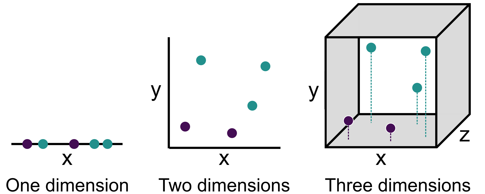
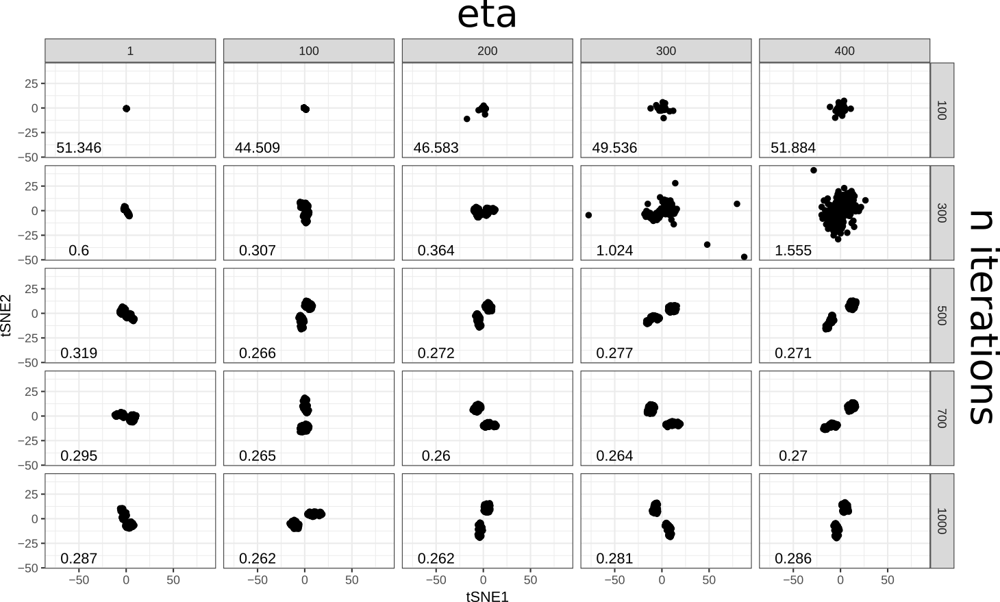

class: inverse, center, middle

# Let's get started

---

# What are the goals of our analysis? 

--

- .large[Identify all cell types present in the sample]

--

- .large[Compare population frequencies between samples]

--

- .large[Compare antigen expression between samples]

--

- .large[Track cell development pathways]

--

- .large[Characterise functional state of populations]  
---

# .small[What challenges are presented by mass cytometry data?]
--

--

- .large[Larger number of parameters than conventional cytometry]

--

- .large[Visualizing the patterns in the data becomes difficult]

--

- .large[Manual gating is difficult to impossible]
  - p(p-1)/2 number of bivariate combinations (435 combinations for 30 paramaters)
  - subjective
  - very likely to miss populations

 
---
background-image: url("img/OMIP_024.png")
background-size: 60%
background-repeat: no-repeat
background-position: 50% 50%

# .small[What challenges are presented by mass cytometry data?]

.footnote[Moncunill et al., 2014]

---
class: center

# How do we solve these challenges?

--

.vlarge[We turn to computational, **machine learning** methods to gate populations for us.]

--

.vlarge[But these techniques can perform poorly when the number of parameters is high. This is due to a phenomenon known as **the curse of dimensionality**.]

---

# The curse of dimensionality

--

- Algorithms that rely on calculating the **distance** between points, suffer in high-dimensional space

--

- In high dimensions most of the "volume" of the **feature space** is empty, or **sparse**

--

- Algorithms are more likely to start learning from noise in the data, rather than signal

--

- Distance also starts to lose its meaning

---
# How do we solve these challenges?

## **Unsupervised** machine learning!

.pull-left[

###  Dimension reduction

&nbsp;

]

.pull-right[

###  Clustering

&nbsp;

]

---
class: inverse, center, middle

# What is dimension reduction?

.vlarge[Dimension reduction algorithms aim to convert a large number of dimensions into a smaller number of dimensions, while preserving as much of the original, high-dimensional information as possible.]

---

class: inverse, center, middle

# What is dimension reduction?

---

# What is dimension reduction?
.pull-left[

##  Mercator projection

&nbsp;

]

--

.pull-right[

##  Audio compression

&nbsp;

]
---

# Common dimension reduction algorithms

--

- **Principal components analysis**

    - Linear dimension reduction
    - The first few PCs explain most of the variation in the data, the rest can be discarded
    - Usually performs poorly for flow cytometry data
--
- **t-distributed stochastic neighbor embedding (t-SNE)**

    - Non-linear dimension reduction
    - Computationally expensive
    - Works well for flow cytometry data
--
- **Uniform manifold approximation and projection (UMAP)**

    - Non-linear dimension reduction
    - Not as computationally expensive
    - Works well for flow cytometry data
--

.footnote[A brand new algorithm called PHATE was released in December: (https://www.biorxiv.org/content/10.1101/120378v1)]

---
class: inverse, center, middle

# t-SNE

---

# How does t-SNE work?

.pull-left[

Calculate distances between each event, and every other event

&nbsp;

]

--

.pull-right[

Randomly distribute the events in a new, two-dimensional space. Iteratively move events closer together that were close by originally

]

---

# What does a t-SNE look like for mass cytometry data?

---

# Hyperparameters of t-SNE

The t-SNE algorithm has **hyperparameters** that control what the final embedding looks like:

- perplexity &emsp;&emsp;&emsp;&emsp;&emsp;&emsp; (emphasis on global vs local structure)
- theta &emsp;&emsp;&emsp;&emsp;&emsp;&emsp;&emsp;&emsp; (0 -> 1 increases speed but decreases accuracy)
- eta &emsp;&emsp;&emsp;&emsp;&emsp;&emsp;&emsp;&emsp;&emsp; (learning rate, default value usually fine)
- n iterations / epochs &emsp; (must be high enough to converge)

--

.pull-left[

]

--

.pull-right[

]

---

# Hyperparameters of t-SNE

---
class: inverse, center, middle

# UMAP

---
class: center, middle

# How does UMAP work?

---
class: center, middle

# What does a UMAP look like for mass cytometry data?

---

# Hyperparameters of UMAP

The UMAP algorithm also has hyperparameters that control what the final embedding looks like:

- n neighbours &emsp;&emsp;&emsp;&emsp;  (emphasis on global vs local structure)
- min distance &emsp;&emsp;&emsp;&emsp;   (clumpy vs spread out points)
- n iterations / epochs &emsp; (must be high enough to converge)

--

---

# Hyperparameters of t-SNE

  

 

    
</a>

    
</a>

    
</a>

  

---

# t-SNE vs. UMAP

.pull-left[

## t-SNE

- Preserves local structure but not global structure
- Computationally expensive
- Cannot map new data onto embedding
- Gives a different embedding each run
- Islands of points tend to be more globular

]

.pull-right[

## UMAP

- Preserves local and *some* global structure
- Computationally less expensive
- New data can be mapped onto existing embedding
- Gives the same embedding each run
- Islands of points tend to follow a continuum

]

---
class: inverse, center, middle

# What is clustering?

.vlarge[Clustering algorithms aim to partition the dataset into discrete **clusters** (populations). A cluster is a set of data points that are more similar to each other, than data points in other clusters.]

---

class: inverse, center, middle

# What is clustering?

---

# What is clustering?

---

# What is clustering?

---

# What is clustering?

---

# What is clustering?

---

# Common clustering algorithms

--

- .large[**k-means/medians** (not great for cytometry)]

--

- .large[**Hierarchical clustering** (not great for flow cytometry)]

--

- .large[**flowMeans and flowPeaks** (outdated)]

--

- .large[**SPADE** (probably superceded by newer algorithms)]

--

- .large[**flowSOM** (state of the art)]

--

- .large[**Phenograph** (state of the art)]

--

- .large[**flowGrid** (very new, state of the art)]

.footnote[flowGrid was released in April 2019: (https://bmcsystbiol.biomedcentral.com/articles/10.1186/s12918-019-0690-2#article-info)]

---